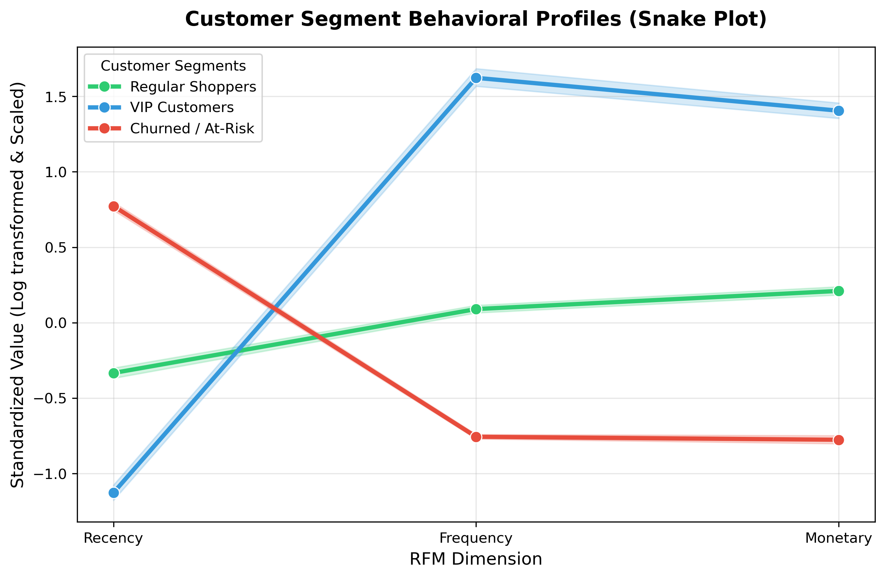
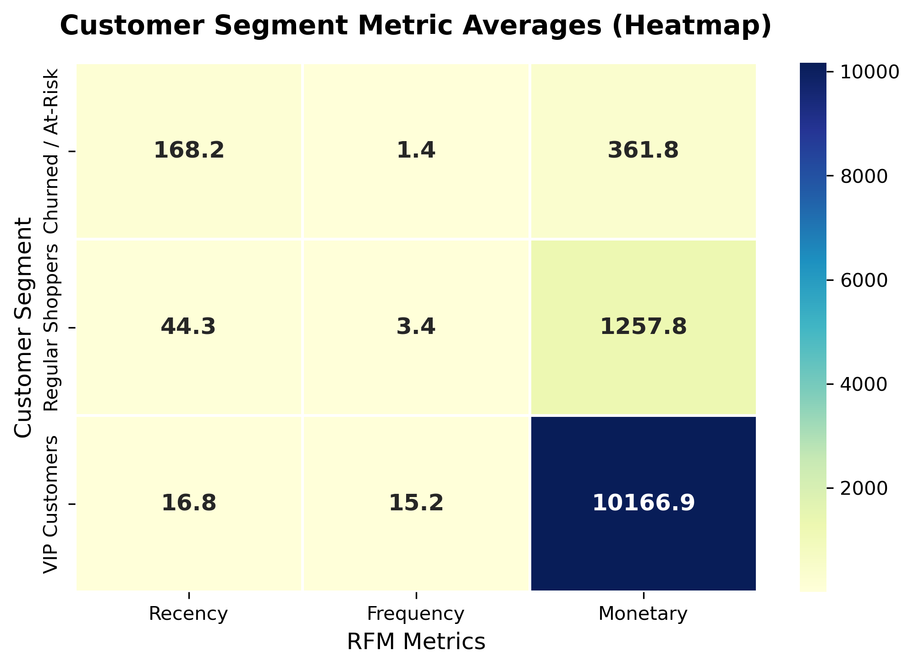

# Customer Analytics Platform: AI-Driven RFM Segmentation

This is a system that takes retail transaction data and divides it into groups based on customer behavior using RFM Clustering. The system is designed to be used in real-world situations and can be easily adapted to work with data sources so businesses can track the value of their customers over time.

## Key Highlights and Business Value

* This system is 100 percent ready for use in real-world situations: it is built on a RFM architecture that can be used by any company regardless of its size or the size of its dataset.

* It can automatically identify customers. Add tags to them so marketing teams can send targeted emails to the right people, such as special rewards for important customers or messages to try to win back customers who have not made a purchase in a while.

* It is also designed to handle data, such as very high-value customers without affecting the overall accuracy of the system.

## Core Implementation Steps

### 1. Data. Engineering

* We started with 541,909 records and cleaned them up to get 530,104 good records by removing cancelled orders and test data.

* We then grouped the purchase history of each customer into a matrix with three dimensions:

* Recency: how many days since the customer made their last purchase.

* Frequency: how unique orders the customer has placed.

* Monetary: how money the customer has spent in total.

### 2. Mathematical Preprocessing

* We used a log transformation to make the data more normal and easier to work with which helped to reduce the impact of large values.

* We also standardized the values to make sure they were all on the scale, which helps to prevent some metrics from having too much influence over the results.

### 3. Machine Learning Clustering

* We used a method called the Elbow Method to figure out the number of clusters to use and we found that three clusters worked the best.

* We then used a K-Means algorithm to divide the customers into these three clusters.

---

## Customer Segment Insights

### 1. VIP Customers (772 clients)

* These customers are our customers: they make purchases frequently they have not made a purchase in a short amount of time and they spend a lot of money.

* We should give them rewards and offer them new products before anyone else.

### 2. Regular Shoppers (1,705 clients)

* These customers are our audience: they make purchases regularly but not as frequently as our VIP customers and they spend a moderate amount of money.

* We should try to encourage them to spend money by offering them special deals and promotions.

### 3. Churned or At-Risk Customers (1,861 clients)

* These customers are at risk of stopping their business with us: they have not made a purchase in a time they do not make purchases frequently and they have not spent much money.

* We should try to win them by sending them special offers and discounts.

### 4. Model Validation & Evaluation

* **Silhouette Analysis:** Evaluated the mathematical separation density of the clusters, achieving a solid **Silhouette Score of 0.336**.
* Verified that all clusters exceed the average silhouette threshold with minimal sample misclassification (negative coefficients), confirming highly stable behavioral boundaries.

### Cluster Separation Analysis (Silhouette Plot)
[Silhouette Plot](customer_segments_silhouette_plot.png)

---

## Visualizations

### Behavioral Profile Map

### Metric Averages Grid

---

## Deliverables Generated

* `01_segmentation.ipynb`. This is the Python code that we used to do the analysis.

* `segmented_customer_data.csv`. This is a spreadsheet that has all of the customer data with each customer tagged as a VIP, regular shopper or, at-risk customer.

